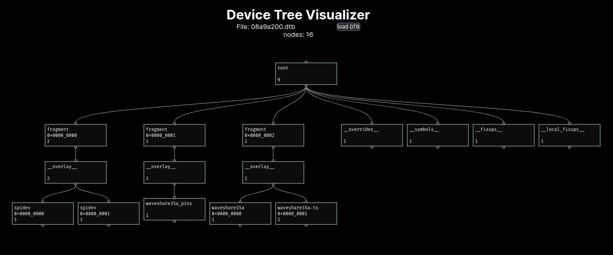

# dtvis

The **dtvis** app helps consumers and engineers understand their devices.
It is a graphical device tree visualizer.

Device trees are used to describe a lot of hardware, especially in the embedded world, and are used in Linux, U-Boot, OpenSBI, Zephyr, FreeBSD, and other firmware, boot loaders and operating systems. A device tree enumerates addresses and other attributes for peripherals, hardware decoders, memory, processing cores and external components attached to systems on chips (SoCs) and printed circuit boards (PCBs), such as SoMs (systems on modules) and SBCs (single board computers).

You can find more information on how device trees are used in the [Embedded Linux Wiki](https://elinux.org/Device_Tree_Mysteries) and in the [Hack the Gadget presentation](https://www.youtube.com/watch?v=CktuSEk8kvg) given at MRMCD 2023.

This application uses [device_tree-rs](https://github.com/platform-system-interface/device_tree-rs) to parse `.dtb` files. More details on how it works are in the [psi_device_tree crate documentation](https://docs.rs/psi_device_tree/latest/psi_device_tree/).

## Screenshot



Here you see a device tree _overlay_ loaded into _dtvis_.

## Local Development

### Preparation

Install `wasm-pack`

```bash
cargo install wasm-pack
npm install
```

### Run the app in development mode

```bash
npm start
```

Open <http://localhost:3000/dtvis> in your browser to see the result.

## Contribute

Feel free to contribute!

## Legal

For legal questions, see [LEGAL.md](LEGAL.md).
